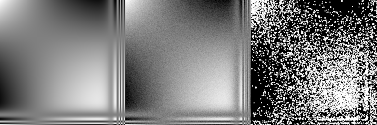

ChickenDream: film grain generator
==================================

Plug-in for Vapoursynth and Avisynth+

This plug-in implements a realistic film grain generator described in the following papers:
* Alasdair Newson, Julie Delon, Bruno Galerne, *A Stochastic Film Grain Model for Resolution-Independent Rendering*, Computer Graphics Forum, Wiley, 2017, https://hal.archives-ouvertes.fr/hal-01520260
* Alasdair Newson, Noura Faraj, Julie Delon, Bruno Galerne, *Realistic Film Grain Rendering*, Image Processing On Line 7, 2017, pp. 165–183, https://www.ipol.im/pub/art/2017/192



Warning: the algorithm is very slow and can take several seconds (multi-threaded) for a single FHD frame. However, in some conditions, the draft mode can be a good compromise between speed and model accuracy.

The generated grain is quite significant, but you can blend the output with the input picture to attenuate the effect.

Main differences with the original algorithm:
* Sampling of the gaussian filter is done with a quasirandom sequence instead of pure random points. This should give a better uniformity.
* Option: rectangular single-pixel filter instead of the gaussian filter
* The formula calculating lambda from the grain size standard deviation has been fixed and should not cause any brightness issues anymore.
* For large lambda (high luminance), the Poisson-distributed random variable generation uses an approximation instead of the inverse transform sampling which becomes slow and inaccurate.

# Compilation

* Windows: open `chickendream\build\win\chickendream.sln` in Visual Studio, `Build` -> `Configuration Manager`, select the desired configuration (most likely *Release x64*) then go to `Build` -> `Build Solution`. The dll is in the `chickendream\`*(configuration)*`\` subdirectory.
* Linux/Mingw: `cd build/win ; ./autogen.sh ; ./configure --enable-clang ; make`. Clang is not mandatory but a bit faster than GCC.

# Usage

ChickenDream only supports gray or RGB colorspaces in 32-bit float format. For correct results, the picture should be in **linear light**, not gamma-compressed. This is important for the grain balance between highlights and shadows.

## Vapoursynth example

```
import vapoursynth as vs
core = vs.core

clip = core.std.BlankClip (width=256, height=256, format=vs.GRAY8, color=[128])
clip = clip.fmtc.transfer (transs="srgb", transd="linear", bits=32)
clip = clip.chkdr.grain ()
clip = clip.fmtc.transfer (transs="linear", transd="srgb")

clip.set_output ()
```

## Avisynth+ example

```
BlankClip (width=256, height=256, pixel_type="Y8", color=$808080)
fmtc_transfer (transs="srgb", transd="linear", bits=32)
chkdr_grain ()
fmtc_transfer (transs="linear", transd="srgb")
```

## Parameters

* **`clip`**: Clip to process. Only 32-bit float is supported, in gray or RGB. Values out of 0–1 are implicitely clipped.

* **`sigma`** (0.35): Radius of the gaussian kernel for the vision filter. Valid range: [0 ; 1]. The larger the radius, the smoother the picture. Smallest values are more prone to aliasing. 0 is a special value indicating that a single-pixel rectangular filter should be used instead of a gaussian. For grains with a small radius (standard use), this should be the fastest option, visually equivalent to `sigma = 0.3`, offering an excellent quality (minimum leaking between adjascent pixels).

* **`res`** (1024): Filter resolution, directly translating into output data bitdepth. Must be greater than 0. 1024 is equivalent to a 10-bit output. Keep in mind that the pixel values are linear. The higher the resolution, the slower the algorithm. Large grains require a smaller `res`.

* **`rad`** (0.025): Average grain radius, in pixels. Must be greater than 0. The smaller the grains, the higher the picture fidelity (given a high enough `res`), and the slower the processing.

* **`dev`** (0): Standard deviation for the log-norm distribution of the grain radius, in [0 ; 1] range. Offers a more realistic result when the grains are big enough to be individually visible, then 0.25 is a good value. Otherwise, keep it to 0 to avoid wasting processing power.

* **`seed`** (12345): Seed for the random generator. A fixed seed gives reproductible results; changing the seed helps to build different variations on the same stream with the same parameters.

* **`cf`** (False): Indicates that the seed is kept constant for all the frames.

* **`cp`** (False): Indicates that the seed is kept constant for all the planes of a single frame. This may slightly reduce the “colored noise” effect on RGB pictures, depending on the content.

* **`draft`** (False): Enables the draft mode, much faster to render, but giving meaningful results only for a small subset of the parameter combinations. Implicitely sets `sigma` to 0, and works correctly with the same conditions (low `rad` and `dev`).

* **`cpuopt`** (-1): 0 = no specific CPU optimisation, 1 = SSE2, 7 = AVX, -1 = maximum available optimisations on the host hardware.
